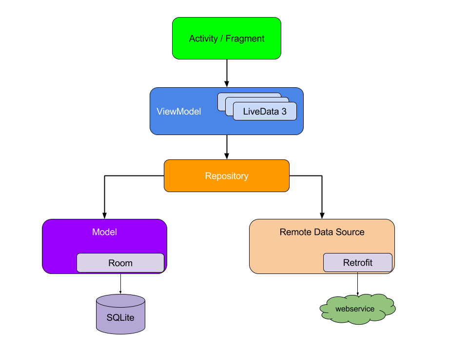
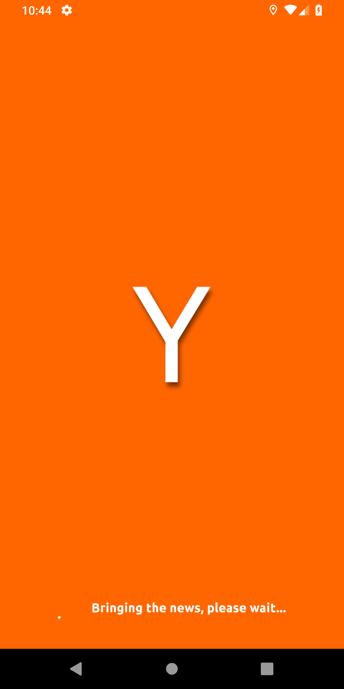
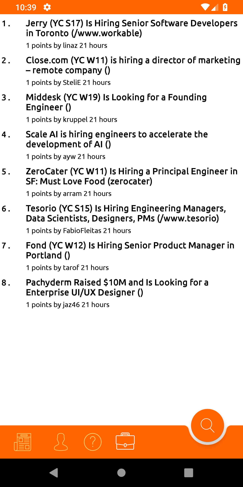

# Hackernews app

This application sample The Hackernews app that implements MVVM architecture using Koin, Room, Coroutines, Retrofit and Eventbus.   

Used <a href="https://github.com/HackerNews/API">HackerNewsAPI</a>.   

<h2> Architecture</h2>

<H2>Used Libraries</H2>

- Kotlin
- MVVM
- Koin
- Kotlin Coroutines
- Retrofit2
- Room
- Timber
- Eventbus

<h2> Screenshots </h2>

<table>
  <tr>
    <th><b>Splash</b></th>
    <th><b>News</b></th>
    <th><b>Jobs</b> </th>
    <th><b>Details</b> </th>
  
  </tr>
  <tr>
    <td>
      </td>
    <td>
      
    </td>
   <td>
      
    </td>
    <td>
      
    </td>
  </tr>
</table>

<h2> Todo List </h2>

- [ ] User information to be added.
- [ ] User post to be added. 
- [x] The app will be written in unit test.
- [ ] Kotlin-Dsl implementation in project.
